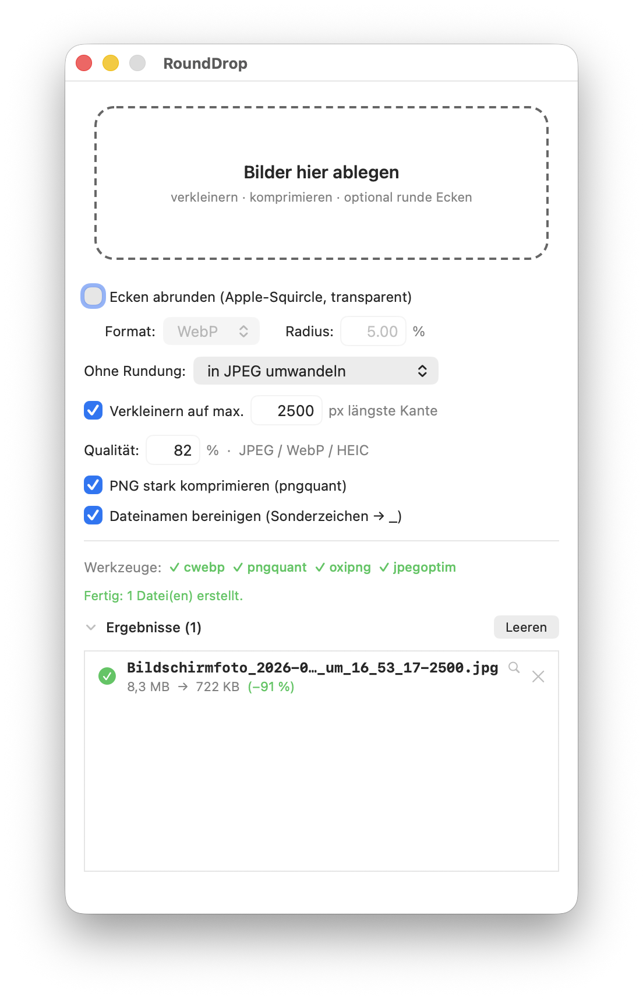

# RoundDrop

Kleines macOS-Droplet: Bilder ablegen → verkleinert, komprimiert und auf Wunsch
mit abgerundeten Ecken (Apple-Squircle, „continuous corners“) und transparentem
Hintergrund.



## Benutzung

**Droplet (Standard):** Bilder aufs Dock-Icon oder im Finder auf `RoundDrop.app`
ziehen. Die App arbeitet still im Hintergrund (verbleibende Dateien als
Dock-Badge), meldet das Ergebnis als Mitteilung und beendet sich selbst.
Beim ersten Mal fragt macOS einmalig nach der Mitteilungs-Erlaubnis.
Verarbeitet wird immer mit den zuletzt im Fenster gespeicherten Einstellungen.

**Fenster:** App per Doppelklick bzw. Dock-Klick starten – dann erscheinen
Einstellungen, Fortschrittsbalken und Ergebnisliste, und die App bleibt offen.
Ein Dock-Klick während einer Hintergrund-Verarbeitung holt das Fenster samt
laufender Liste hervor.

**Ergebnisliste:** pro Datei Status (Uhr → grüner Haken bzw. rotes ×),
Größe „vorher → nachher“ mit Ersparnis in Prozent. Ein Klick auf die Zeile
(Lupensymbol) zeigt die fertige Datei im Finder, × entfernt den Eintrag,
„Leeren“ die ganze Liste. Der Bereich lässt sich ein-/ausklappen; die App
merkt sich den Zustand.

Die Ergebnisdatei landet immer neben dem Original:

| Modus | Ausgabe | Beispiel |
|---|---|---|
| Ecken abrunden **an** | WebP oder PNG (transparent), Suffix `-rund` | `logo-rund.webp` |
| Ecken abrunden **aus** | JPEG (Standard) oder Eingabeformat, Suffix = Pixel-Limit | `foto-2500.jpg` |
| aus, ohne Verkleinern | wie oben, Suffix `-opt` | `foto-opt.jpg` |

## Einstellungen (im Fenster)

- **Ecken abrunden:** an/aus. An = Squircle-Ecken + transparenter Hintergrund;
  aus = nur verkleinern, komprimieren, umbenennen.
- **Format** (nur mit Rundung): WebP (klein, ideal fürs Web) oder PNG.
- **Radius:** Prozent der kürzeren Bildkante. `22,37` = der dokumentierte
  Apple-Squircle der System-Icons. Die Kurve ist immer Apples geglättete
  „continuous“-Kurve, keine Kreisecken.
- **Ohne Rundung:** standardmäßig wird alles **in JPEG umgewandelt**
  (maximale Kompatibilität – HEIC/PNG versteht nicht jeder Empfänger;
  Transparenz wird auf Weiß gelegt). Wahlweise lässt sich stattdessen das
  Eingabeformat beibehalten (JPEG bleibt JPEG, PNG bleibt PNG, HEIC bleibt HEIC).
- **Verkleinern auf max. n px:** begrenzt die längere Bildkante (Standard
  2500 px), proportional und hochwertig, vergrößert niemals. Abschaltbar.
- **Qualität:** 1–100 %, gilt für JPEG, WebP und HEIC (Standard 82).
- **PNG stark komprimieren:** dieselben Kompressoren wie ImageOptim –
  `pngquant` (verlustarme Farbquantisierung) plus `oxipng`/`optipng`
  (verlustfrei). Abgehakt bleibt nur die verlustfreie Stufe aktiv.
- **Dateinamen bereinigen:** `Täst Bild (2026) übel.png` → `Taest_Bild_2026_uebel-2500.jpg`
  (Umlaute → ae/oe/ue/ss, Akzente entfernt, Leer-/Sonderzeichen → `_`).
- **Werkzeuge-Zeile:** zeigt grün/rot, welche der vier Kommandozeilen-Helfer
  installiert sind; der Tooltip nennt bei fehlenden den `brew install`-Befehl.

JPEGs werden zusätzlich mit `jpegoptim` nachoptimiert und von Metadaten
befreit (falls installiert). Die EXIF-Ausrichtung von iPhone-Fotos wird
beim Laden korrekt eingerechnet.

## Download & Installation

Fertiger Build: siehe [Releases](https://github.com/noestreich/RoundDrop/releases).
ZIP entpacken, `RoundDrop.app` z. B. in den Programme-Ordner ziehen.

Die App ist nur ad-hoc signiert (kein Apple-Developer-Zertifikat). macOS
blockiert sie nach dem Download deshalb zunächst — einmalig freigeben mit:

```bash
xattr -dr com.apple.quarantine RoundDrop.app
```

(oder Rechtsklick → Öffnen → „Trotzdem öffnen“.)

Optionale Helfer für kleinere Dateien:

```bash
brew install webp pngquant oxipng jpegoptim
```

Ohne sie fällt die App automatisch auf PNG bzw. unoptimierte Ausgabe zurück.

## Neu bauen

Benötigt nur die Xcode-Kommandozeilenwerkzeuge:

```bash
./build.sh
```

## Kommandozeile (optional)

```bash
RoundDrop.app/Contents/MacOS/RoundDrop [--round|--no-round|--jpeg] [--png|--webp] \
    [--keep-format] [--lossless] [--radius=22.37] [--quality=0.82] [--max=2500] \
    [--keep-name] bild1.jpg bild2.png …
```

- `--round` / `--no-round`: Eckenrundung erzwingen/überspringen
- `--jpeg`: ohne Rundung alles nach JPEG; `--keep-format`: Eingabeformat behalten
- `--max=2500`: längste Kante begrenzen, `--max=0` schaltet das Verkleinern aus
- `--lossless`: PNG nur verlustfrei optimieren (ohne pngquant)
- `--keep-name`: Dateinamen nicht bereinigen

Ohne Flags gelten die zuletzt im Fenster gespeicherten Einstellungen.

## Technik

- Ein einziges Swift-File ([Sources/main.swift](Sources/main.swift)), AppKit + SwiftUI-Pfad
  (`RoundedRectangle(style: .continuous)`) für die exakte Apple-Kurve.
- Verkleinern geschieht beim Dekodieren in einem Schritt
  (`kCGImageSourceThumbnailMaxPixelSize`), inklusive EXIF-Korrektur.
- WebP-Export über `cwebp` (Homebrew), da macOS-ImageIO WebP nur lesen kann.
  Ohne `cwebp` fällt die App automatisch auf PNG zurück.
- PNG-Optimierung über `pngquant` + `oxipng` (bzw. `optipng`); fehlende Tools
  werden einfach übersprungen. Messwerte Testbild (640×400-Verlauf):
  237 KB roh → 104 KB verlustfrei → 20 KB mit pngquant → 3,9 KB als WebP.
- Hintergrund-Modus: Start per Datei-Drop erzeugt kein Fenster; Ergebnis kommt
  als Systemmitteilung, danach beendet sich die App. Beenden wartet stets,
  bis laufende Verarbeitungen abgeschlossen sind.
